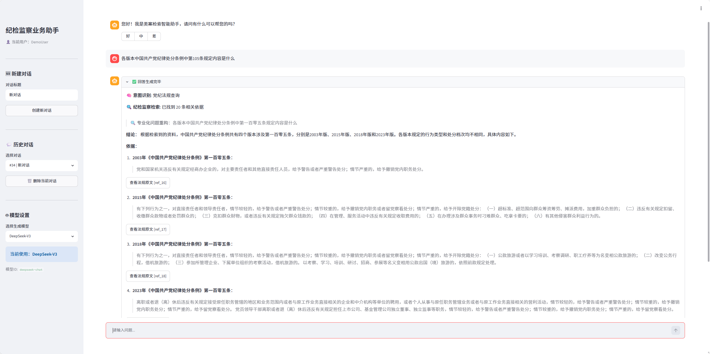
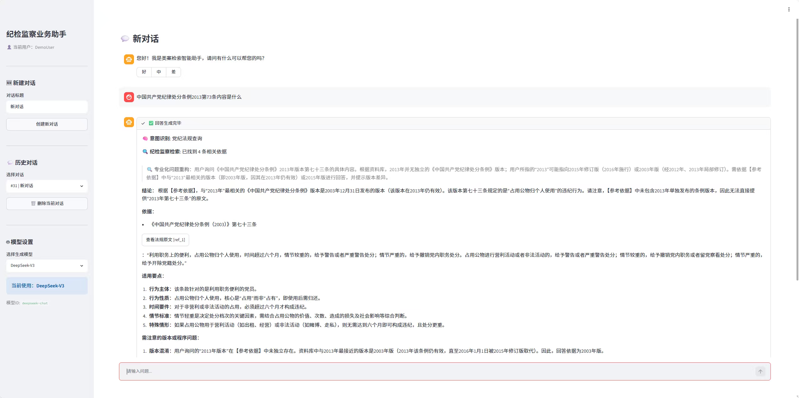
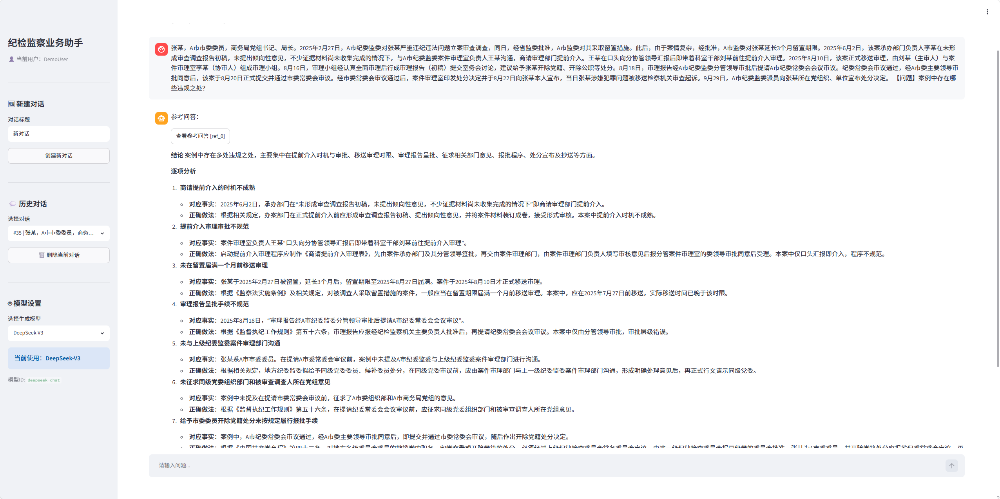

# 纪检监察业务助手

一个面向纪检监察业务场景的本地知识库问答系统，基于 **Streamlit + LangGraph + RAG 混合检索** 构建，支持党纪法规查询、线索研判、办案规范检索、业务题库参考回答、公共/私有知识库管理和用户反馈闭环。

> 说明：本仓库只包含程序代码和空目录占位文件，不包含法律法规、案例、办案规范、业务题库、向量索引、模型权重和任何内部资料。



## 功能亮点

- **党纪法规查询**：支持法规名称归一化、中文条号识别、历史版本查询和多版本对比。
- **线索研判**：结合相似案例、党纪法规和办案规范，辅助梳理问题焦点、纪法方向、证据缺口和程序要点。
- **业务问答模式**：识别培训题、案例分析题、办案程序题，优先调用本地配套参考答案。
- **办案规范库**：支持扫描 PDF OCR、DOC/DOCX、XLSX 等材料预处理，独立建库。
- **混合检索**：FAISS 向量检索 + BM25 关键词检索，通过 RRF 融合排序。
- **引用溯源**：回答中的法规、案例、办案规范、业务问答均可点击查看来源内容。
- **多轮会话**：支持历史对话、标题自动生成、模型切换和用户反馈。
- **登录注册与用户隔离**：每个账号只能查看、创建、删除自己的历史对话，避免不同使用者共享同一 Demo 用户数据。
- **公共/私有知识库**：支持公共知识库与私有知识库同时检索，可按监督室创建专属知识库。
- **在线上传入库**：页面内上传法规、案例、办案规范、业务题库文件，后台自动保存、分片并更新向量索引。
- **回答质量反馈**：每条 AI 回复支持“好 / 中 / 差”评分，“中 / 差”可填写改进意见，便于后续优化知识库和提示词。

## 界面预览

### 多版本法规查询

可一次查询同一条文在不同版本中的内容。


### 指定版本法规查询

可根据用户指定年份定位对应版本条文。



### 业务问答参考答案

粘贴题库原题或高度相似题面时，系统会进入业务问答模式，优先完整呈现参考答案得分点。



## 技术架构

```text
用户问题
  ↓
意图识别
  ├─ business_qa  业务问答
  ├─ statute      党纪法规查询
  ├─ complex      线索研判
  └─ normal       正常问答
  ↓
多知识库混合检索
  ├─ 公共案例库 + 私有案例库
  ├─ 公共法规库 + 私有法规库
  ├─ 公共办案规范库 + 私有办案规范库
  └─ 公共业务问答库 + 私有业务问答库
  ↓
引用编号与来源映射
  ↓
LLM 生成回答
  ↓
Streamlit 页面展示与引用展开
```

## 项目结构

```text
.
├── streamlit_app.py                 # Streamlit Web UI
├── agent_graph.py                   # LangGraph 智能体、路由、提示词和引用逻辑
├── model_utils.py                   # RAG、嵌入模型、向量检索、查询增强
├── BM25Retriever.py                 # BM25 检索器
├── DocumentProcessor.py             # 文档处理
├── DocumentSplitter.py              # 文档切分
├── build_index.py                   # 案例/法规索引构建入口
├── prepare_guidance_documents.py    # 办案规范 OCR 与结构化
├── build_guidance_index.py          # 办案规范索引构建
├── prepare_qa_documents.py          # 业务问答 DOCX 配对结构化
├── build_qa_index.py                # 业务问答索引构建
├── requirements.txt                 # 主环境依赖
├── requirements-ocr.txt             # OCR 环境依赖
├── .env.example                     # 环境变量模板
├── docs/images/                     # README 展示图片
├── knowledge_base_case/.gitkeep     # 案例库占位，不提交真实数据
├── knowledge_base_lp/.gitkeep       # 法规库占位，不提交真实数据
├── knowledge_base_guidance/.gitkeep # 办案规范库占位，不提交真实数据
├── knowledge_base_qa/.gitkeep       # 业务问答库占位，不提交真实数据
├── private_knowledge_bases/         # 运行时私有知识库，不提交
└── private_law_faiss/               # 运行时私有向量索引，不提交
```

## 环境准备

推荐使用 Conda：

```bash
conda create -n legal-search python=3.11 -y
conda activate legal-search
python -m pip install --upgrade pip setuptools wheel
python -m pip install -r requirements.txt
```

如果使用 CPU 版 FAISS：

```bash
python -m pip install faiss-cpu
```

如果使用 CUDA GPU，可按服务器环境安装对应版本的 FAISS GPU。昆仑芯等非 NVIDIA 环境通常只让本项目调用已经部署好的模型服务，Web/RAG 侧仍可使用 CPU 运行。

## 环境变量

复制模板：

```bash
cp .env.example .env
```

至少配置：

```env
DEEPSEEK_API_KEY=你的Key或本地兼容服务Key
DEEPSEEK_BASE_URL=https://api.deepseek.com/v1

VECTOR_CASE_DB_PATH=./law_faiss_case
VECTOR_LP_DB_PATH=./law_faiss_lp
VECTOR_GUIDANCE_DB_PATH=./law_faiss_guidance
VECTOR_QA_DB_PATH=./law_faiss_qa

GUIDANCE_RECORDS_PATH=./knowledge_base_guidance/records
QA_RECORDS_PATH=./knowledge_base_qa/records
DATABASE_URL=sqlite:///./data/user.db
AUTH_COOKIE_DAYS=30
```


## 数据准备

本仓库不包含任何业务数据，需要自行准备：

### 1. 案例库

放置到：

```text
knowledge_base_case/<CASE_KB_SUBDIR>/
```

JSON 建议包含：

```text
pid, fact, reason, result, charge, article, qw
```

### 2. 法规库

放置到：

```text
knowledge_base_lp/
```

建议一行一条：

```text
《法规名称版本》第一条 正文内容
```

### 3. 办案规范库

使用独立 OCR 环境：

```bash
conda create -p .ocr_env python=3.11 pip pysocks -y
./.ocr_env/bin/python -m pip install -r requirements-ocr.txt
```

Windows PowerShell 示例：

```powershell
.\.ocr_env\python.exe prepare_guidance_documents.py `
  --source "E:\path\to\办案工作规范性文件汇编（三大本）" `
  --output knowledge_base_guidance
```

构建索引：

```bash
python build_guidance_index.py
```

### 4. 业务问答库

题目和答案按数字配对，例如：

```text
1.docx    # 题目
1.1.docx  # 答案
```

处理并建库：

```powershell
.\.ocr_env\python.exe prepare_qa_documents.py `
  --source "E:\path\to\qa_docs" `
  --output knowledge_base_qa

.\.venv\Scripts\python.exe build_qa_index.py
```

## 页面上传知识库

登录后可在侧边栏进入 **上传知识库**：

1. 选择知识库范围：公共知识库或某个私有知识库。
2. 选择知识库类型：法规、案例、办案规范、业务题库。
3. 上传文件，系统会保存源文件、按类型分片，并更新对应 FAISS + BM25 索引。
4. 在侧边栏选择需要调用的私有知识库，检索时会同时查询公共知识库和该私有知识库。

支持格式：

```text
法规：TXT / DOCX / PDF，后台尽量按条文切分，行首法规名优先取文件名。
案例：TXT / DOCX / XLSX / CSV，Excel 会按行提取事实、处理结果、条款等字段。
办案规范：TXT / DOCX / PDF，PDF 优先文本提取，扫描件可配合 OCR 环境处理。
业务题库：TXT / DOCX / XLSX / CSV，支持题目与答案材料入库。
```

> 私有知识库目录与索引目录已在 `.gitignore` 中排除。不要把单位内部资料、真实案例或生成后的索引提交到 GitHub。

## 构建与运行

构建案例和法规索引：

```bash
python build_index.py
```

启动应用：

```bash
streamlit run streamlit_app.py
```

服务器部署示例：

```bash
conda activate legal-search
export PYTHONUTF8=1

nohup python -m streamlit run streamlit_app.py \
  --server.address 0.0.0.0 \
  --server.port 8501 \
  --server.headless true \
  > streamlit.log 2>&1 &
```

## 模型服务

项目通过 OpenAI-compatible Chat API 调用大模型。云端 DeepSeek 或内网本地 DeepSeek 都可以使用同一套配置：

```env
DEEPSEEK_API_KEY=local-key
DEEPSEEK_BASE_URL=http://内网模型服务IP:端口/v1
```

如果服务器存在代理，内网模型服务需要加入代理例外：

```bash
export NO_PROXY=127.0.0.1,localhost,内网模型服务IP
export no_proxy=127.0.0.1,localhost,内网模型服务IP
```

嵌入模型默认使用本地 BGE-M3 或兼容的 sentence-transformers 模型目录。离线部署时请提前准备模型缓存或把模型目录复制到服务器。

## 用户与反馈

- 首次进入系统可注册账号；登录后历史对话按用户隔离。
- 浏览器会保存登录状态，减少重复登录。
- AI 回答下方提供“好 / 中 / 差”评分；“中 / 差”可填写意见。
- 反馈保存在 SQLite 数据库中，可用于后续查看高频问题、修订提示词和补充知识库。

## 不应提交到 GitHub 的内容

以下内容均已在 `.gitignore` 中排除：

```text
.env
.venv/
.ocr_env/
data/
data_import_manifests/
knowledge_base_case/*
knowledge_base_lp/*
knowledge_base_guidance/*
knowledge_base_qa/*
law_faiss_*/
model_cache/
*.zip
*.log
*.db
*.pkl
```

只保留各知识库目录下的 `.gitkeep`，用于展示目录结构。

## 安全提醒

- 不要将内部文件、工作秘密、真实案例、API Key、数据库文件提交到公开仓库。
- 生产环境应配置真实用户认证、权限控制、访问审计和内网隔离。
- 本项目输出仅用于辅助检索和业务研判，不构成正式法律意见或处分处理依据。

## License

本项目使用 [Apache License 2.0](LICENSE)。
